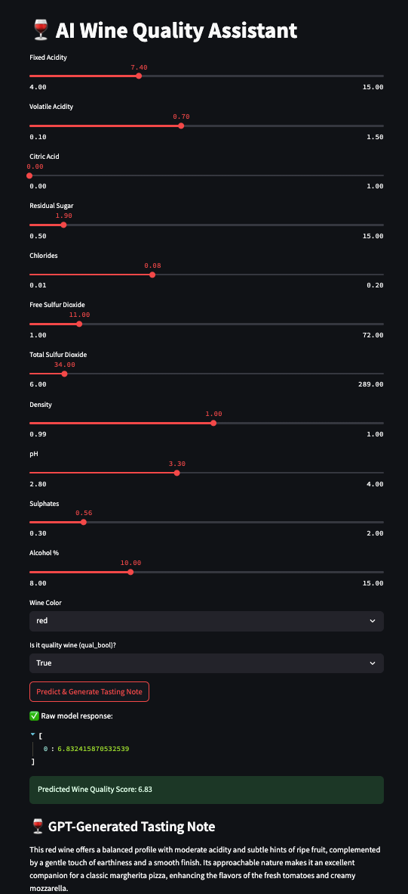

# wine-quality-app
🍷 AI Wine Quality Assistant
This Streamlit app uses a machine learning model deployed via Azure Machine Learning to predict wine quality from chemical properties. It then uses OpenAI's GPT-4o to generate a tasting note and food pairing suggestion based on the prediction.

🚀 Features
Predicts wine quality score based on chemical properties

Generates tasting notes using OpenAI GPT

Built with Streamlit

Backed by Azure ML for model inference

Fully configurable via .streamlit/secrets.toml

### 🧪 Demo

